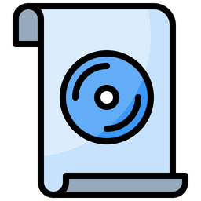

# audio-converter

Simple python ffmpeg wrapper. Works on macOS. Has a nice folder icon.

I made this because the Roland SPDSX only takes 44.1khz 16bit .wav files and I had a hundreds to convert.

- Put files to convert in the IN folder
- Run CONVERT.command
- Follow the steps

You can modify the convert.py file if you need other formats / samples rates / bit rates
